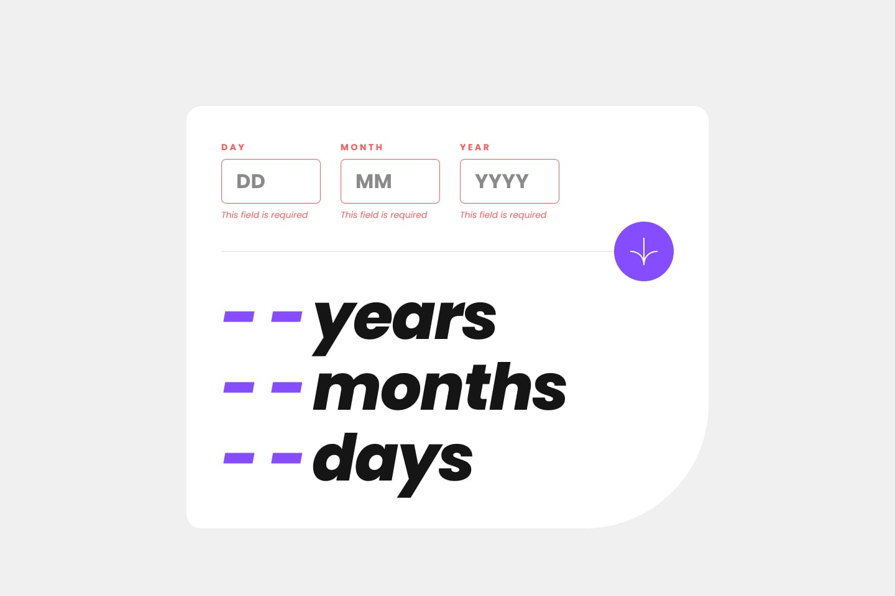

# Frontend Mentor - Age calculator app solution

This is a solution to the [Age calculator app challenge on Frontend Mentor](https://www.frontendmentor.io/challenges/age-calculator-app-dF9DFFpj-Q). Frontend Mentor challenges help you improve your coding skills by building realistic projects.

## Table of contents

- [Overview](#overview)
  - [The challenge](#the-challenge)
  - [Screenshot](#screenshot)
  - [Links](#links)
- [My process](#my-process)
  - [Built with](#built-with)
  - [What I learned](#what-i-learned)
- [Author](#author)

## Overview

### The challenge

Users should be able to:

- [x] View an age in years, months, and days after submitting a valid date through the form
- [x] Receive validation errors if:
  - [x] Any field is empty when the form is submitted
  - [x] The day number is not between 1-31
  - [x] The month number is not between 1-12
  - [x] The year is in the future
  - [x] The date is invalid e.g. 31/04/1991 (there are 30 days in April)
- [x] View the optimal layout for the interface depending on their device's screen size
- [x] See hover and focus states for all interactive elements on the page
- [ ] **Bonus**: See the age numbers animate to their final number when the form is submitted

### Screenshot

|                        Design                        |   Result   |
| :--------------------------------------------------: | :--------: |
|            |  |
|       |  |
|     |  |
|  |  |
|             |  |
|         |  |
|             |  |

**Note: I will update the result picture later.**

### Links

- [Solution]()
- [Live Site](https://age-calculator-app-dondamad.vercel.app/)

## My process

### Built with

- Mobile-first workflow
- [React](https://reactjs.org/) - JS library
- [Next.js](https://nextjs.org/) - React framework
- [Tailwind CSS](https://tailwindcss.com/) - For styles
- [react-hook-form](https://www.react-hook-form.com/) - Fpr manage form state and validation
- [zod](https://zod.dev/) - For schema-based validation
- [date-fns](https://date-fns.org/) - For date manipulation and calculation

### What I learned

- How to handle forms and validate form inputs using the react-hook-form library in a React application.
- How to define form schemas and perform validation using the zod library.
- How to manipulate dates and calculate age using the date-fns library.

## Author

- Website - [Add your name here](https://www.your-site.com)
- Frontend Mentor - [@Dondamad](https://www.frontendmentor.io/profile/Dondamad)
